---
## Front matter
title: "Шаблон отчёта по лабораторной работе #1"
subtitle: "По дисциплине Математическое моделирование"
author: "Прокошев Никита Евгеньевич"

## Generic otions
lang: ru-RU
toc-title: "Содержание"

## Bibliography
bibliography: bib/cite.bib
csl: pandoc/csl/gost-r-7-0-5-2008-numeric.csl

## Pdf output format
toc: true # Table of contents
toc-depth: 2
lof: true # List of figures
lot: true # List of tables
fontsize: 12pt
linestretch: 1.5
papersize: a4
documentclass: scrreprt
## I18n polyglossia
polyglossia-lang:
  name: russian
  options:
	- spelling=modern
	- babelshorthands=true
polyglossia-otherlangs:
  name: english
## I18n babel
babel-lang: russian
babel-otherlangs: english
## Fonts
mainfont: PT Serif
romanfont: PT Serif
sansfont: PT Sans
monofont: PT Mono
mainfontoptions: Ligatures=TeX
romanfontoptions: Ligatures=TeX
sansfontoptions: Ligatures=TeX,Scale=MatchLowercase
monofontoptions: Scale=MatchLowercase,Scale=0.9
## Biblatex
biblatex: true
biblio-style: "gost-numeric"
biblatexoptions:
  - parentracker=true
  - backend=biber
  - hyperref=auto
  - language=auto
  - autolang=other*
  - citestyle=gost-numeric
## Pandoc-crossref LaTeX customization
figureTitle: "Рис."
tableTitle: "Таблица"
listingTitle: "Листинг"
lofTitle: "Список иллюстраций"
lotTitle: "Список таблиц"
lolTitle: "Листинги"
## Misc options
indent: true
header-includes:
  - \usepackage{indentfirst}
  - \usepackage{float} # keep figures where there are in the text
  - \floatplacement{figure}{H} # keep figures where there are in the text
---

# Цель работы

Цель лабораторной работы - восстановление знаний о копировании репозитория и его установке на компьютер, а также созданию отчётов в markdown и его переносе в другие форматы (такие, как docx и pdf).

# Задание

1. Скопировать шаблон репозитория на свой git и перенести его на компьютер.
2. Удалить файл package.json из папки.
3. Скопировать репозиторий обратно из компьютера в git.
4. Создать отчёт о проделанной работе в markdown и перенести отчёт в форматы docx и pdf.

# Теоретическое введение

: Описание команд, используемых в лабораторной работе

| Имя команды | Описание команды                                                                                                          |
|--------------|----------------------------------------------------------------------------------------------------------------------------|
| cd          | Сменить директорию нынешнего положения                                                                              |
| rm     | Удаление файла из папки     |
| git push      | Скопировать папку на git                                           |
| pandoc report.md -o report.docx      | Создание копии файла из формата markdown (.md) в формат .docx  |
| --pdf-engine=pdflatex     | Определение движка, используемого для конвертации файла в формат .pdf                                                                                   |
| -V mainfont="CMU Serif"      | Задание шрифта для конвертации файла в формат .pdf                                                                                   |

# Выполнение лабораторной работы

1.Проверка наличия ssh-ключа (Рис. 1):

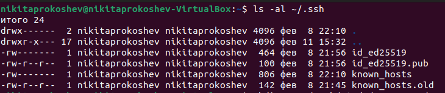{#fig:001 width=70%}

2.Создание репозитория курса на основе шаблона(Рис. 2):

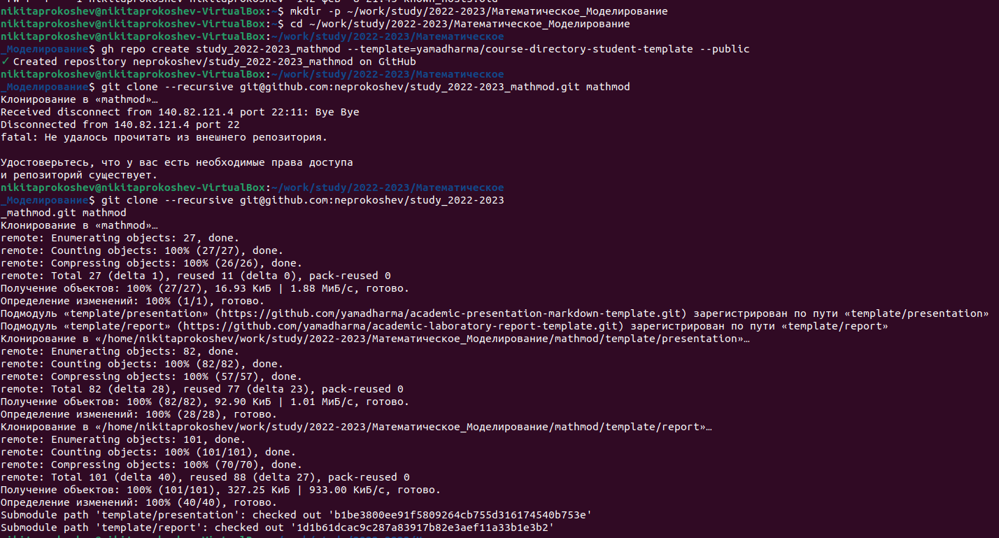{#fig:001 width=70%}

3.Настройка каталога курса: переход в каталог курса, удаление лишнего файла package.json, создание необходимых каталогов (Рис. 3) и отправка файлов на сервер (Рис. 4-7):

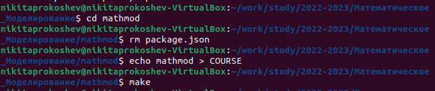{#fig:001 width=70%}
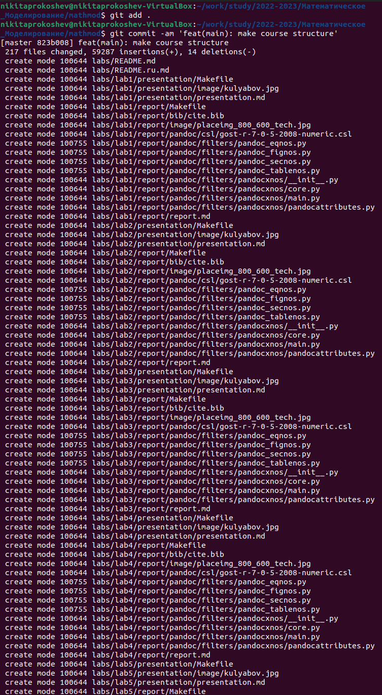{#fig:001 width=70%}
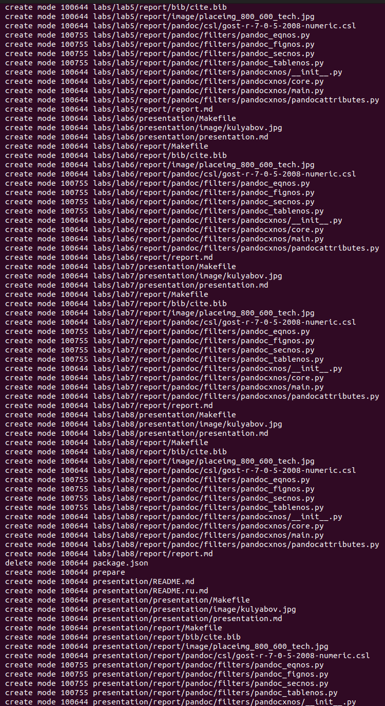{#fig:001 width=70%}
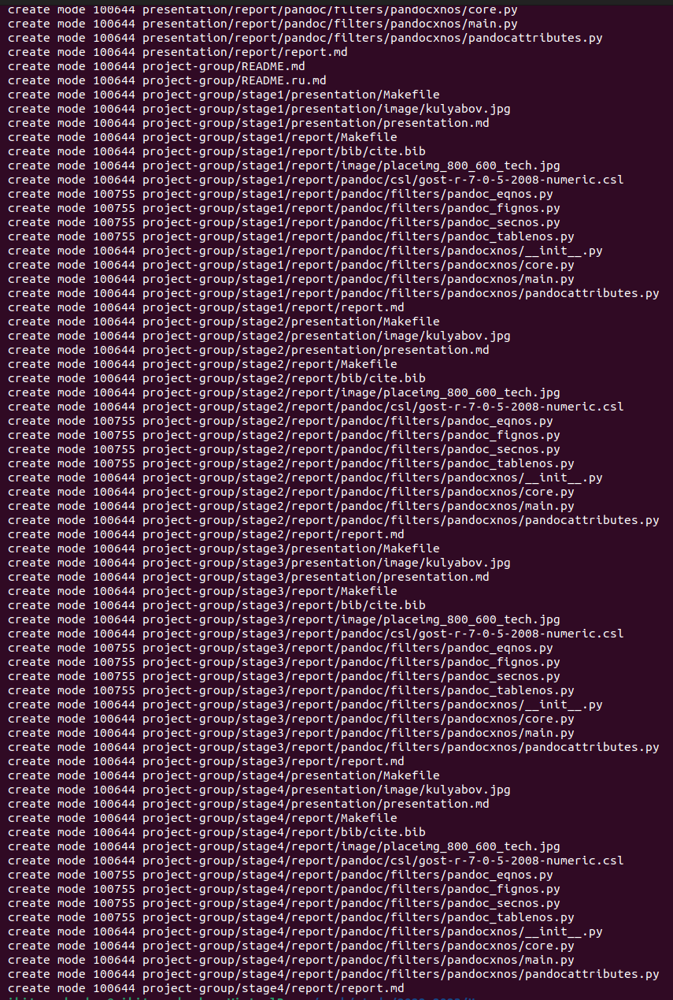{#fig:001 width=70%}
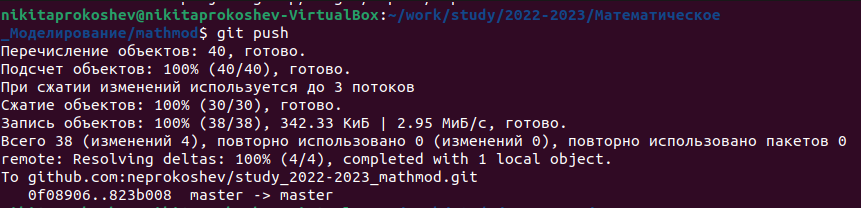{#fig:001 width=70%}

4.Конвертируем файл отчёта из формата markdown (.md) в .docx (Рис. 8) и формат .pdf (Рис. 9-12):

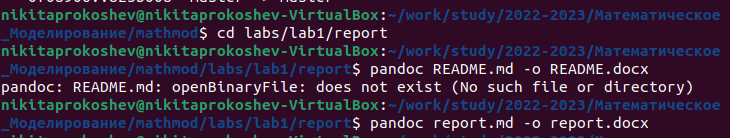{#fig:001 width=70%}
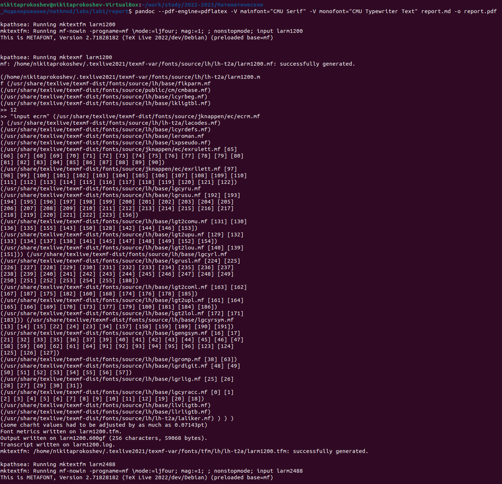{#fig:001 width=70%}
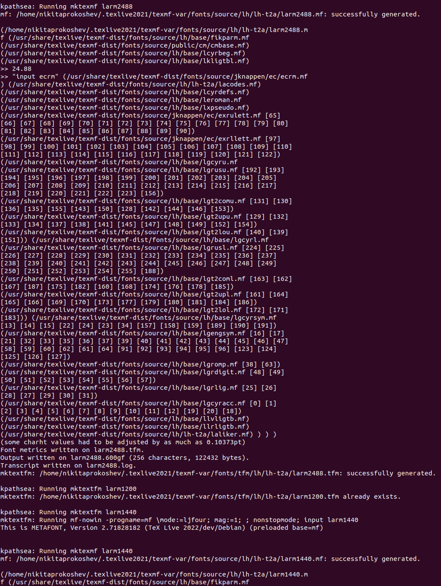{#fig:001 width=70%}
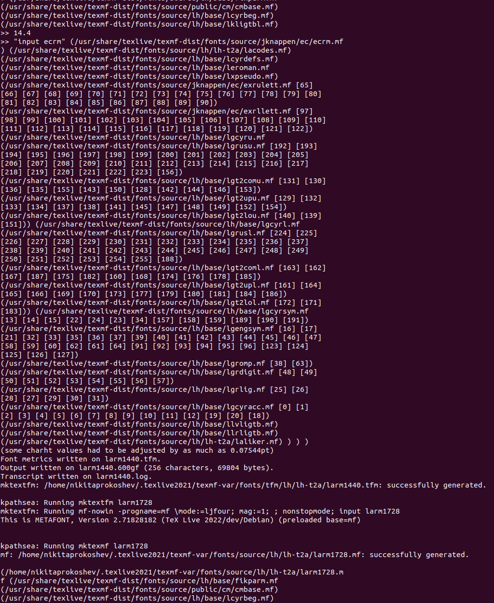{#fig:001 width=70%}
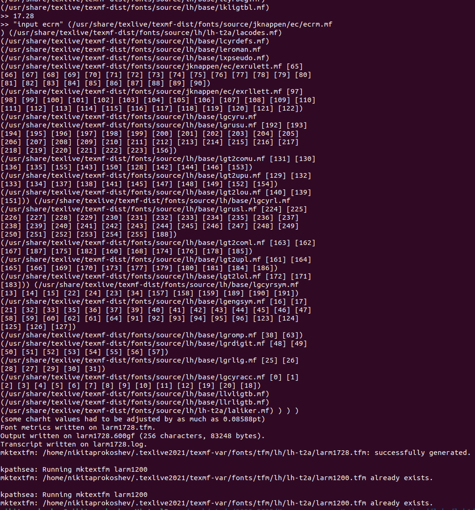{#fig:001 width=70%}

# Выводы

В рамках данной лабораторной работы мы научились проверять наличие ssh-ключа, создавать репозиторий на основе шаблона, создавать отчёт в формате markdown и конвертировать его в форматы .docx и .pdf.

# Список литературы{.unnumbered}

::: {#refs}
:::
