---
## Front matter
title: "Шаблон отчёта по лабораторной работе №2"
subtitle: "По дисциплине Математическое моделирование"
author: "Прокошев Никита Евгеньевич"

## Generic otions
lang: ru-RU
toc-title: "Содержание"

## Bibliography
bibliography: bib/cite.bib
csl: pandoc/csl/gost-r-7-0-5-2008-numeric.csl

## Pdf output format
toc: true # Table of contents
toc-depth: 2
lof: true # List of figures
lot: true # List of tables
fontsize: 12pt
linestretch: 1.5
papersize: a4
documentclass: scrreprt
## I18n polyglossia
polyglossia-lang:
  name: russian
  options:
	- spelling=modern
	- babelshorthands=true
polyglossia-otherlangs:
  name: english
## I18n babel
babel-lang: russian
babel-otherlangs: english
## Fonts
mainfont: PT Serif
romanfont: PT Serif
sansfont: PT Sans
monofont: PT Mono
mainfontoptions: Ligatures=TeX
romanfontoptions: Ligatures=TeX
sansfontoptions: Ligatures=TeX,Scale=MatchLowercase
monofontoptions: Scale=MatchLowercase,Scale=0.9
## Biblatex
biblatex: true
biblio-style: "gost-numeric"
biblatexoptions:
  - parentracker=true
  - backend=biber
  - hyperref=auto
  - language=auto
  - autolang=other*
  - citestyle=gost-numeric
## Pandoc-crossref LaTeX customization
figureTitle: "Рис."
tableTitle: "Таблица"
listingTitle: "Листинг"
lofTitle: "Список иллюстраций"
lotTitle: "Список таблиц"
lolTitle: "Листинги"
## Misc options
indent: true
header-includes:
  - \usepackage{indentfirst}
  - \usepackage{float} # keep figures where there are in the text
  - \floatplacement{figure}{H} # keep figures where there are in the text
---

# Цель работы

Цель: Целью данной лабораторной работы является изучение языка программирования Julia и изучение задачи о погоне а также её решении.

# Задание

1. Решение задачи о погоне.
2. Изучение основ работы с языком программирования Julia и OpenModelica.
3. Перевод решения задачи о погоне в программу на языке Julia.
4. Перевод решения задачи о погоне в программу на языке OpenModelica.

# Теоретическое введение

Julia -- это высокоуровневый язык программирования с динамической типизацией, созданный в 2009 году Стефаном Карпински для математических вычислений. Синтаксис языка схож с синтаксисом других математических языков (например, MATLAB и Octave), однако имеет некоторые существенные отличия. Julia написан на Си, C++ и Scheme.[@link1]

OpenModelica - свободное открытое программное обеспечение для моделирования, симуляции, оптимизации и анализа сложных динамических систем. Основано на языке Modelica.

Активно развивается Open Source Modelica Consortium, некоммерческой неправительственной организацией. Open Source Modelica Consortium является совместным проектом RISE SICS East AB и Линчёпингского университета.

OpenModelica используется в академической среде и на производстве. В промышленности используется в области оптимизации энергоснабжения, автомобилестроении и водоочистке.[@link2]

# Выполнение лабораторной работы

1. Переходим в gpaint для решения задачи о погоне "на бумаге" (Рис. 1).
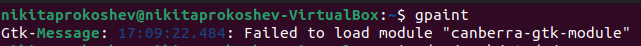{#fig:001 width=70%} 

2. Расчёт 2 случаев начального положения спирали: k/5.3 и k/3.3 (Рис. 2).
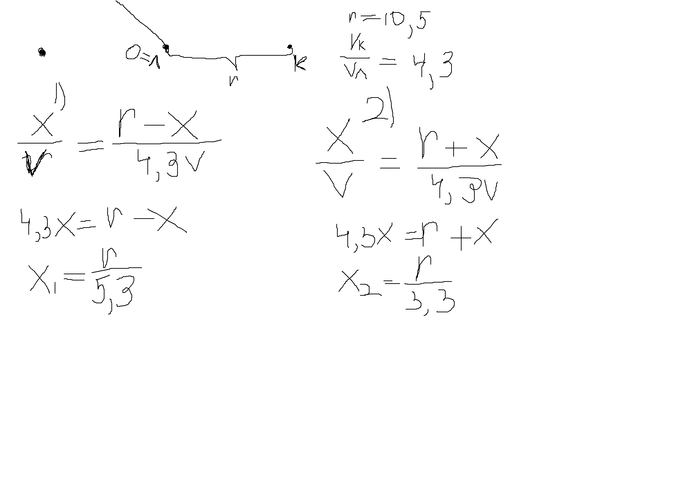{#fig:001 width=70%}

3. Расчёт радиальной и танценциальной скоростей катера (Рис. 3).
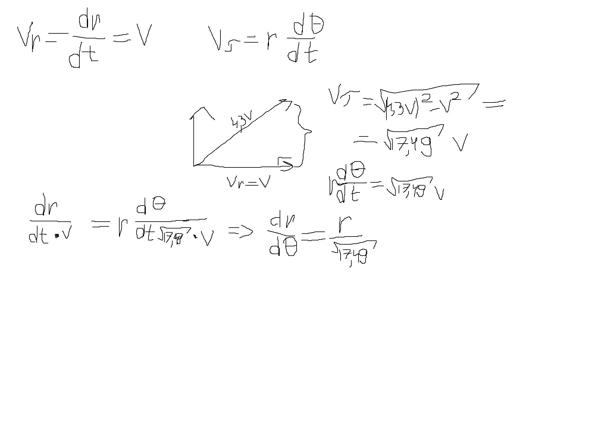{#fig:001 width=70%}

4. Решение дифференциального уравнения и расчёт формулы для нахождения позиции катера (Рис. 4).
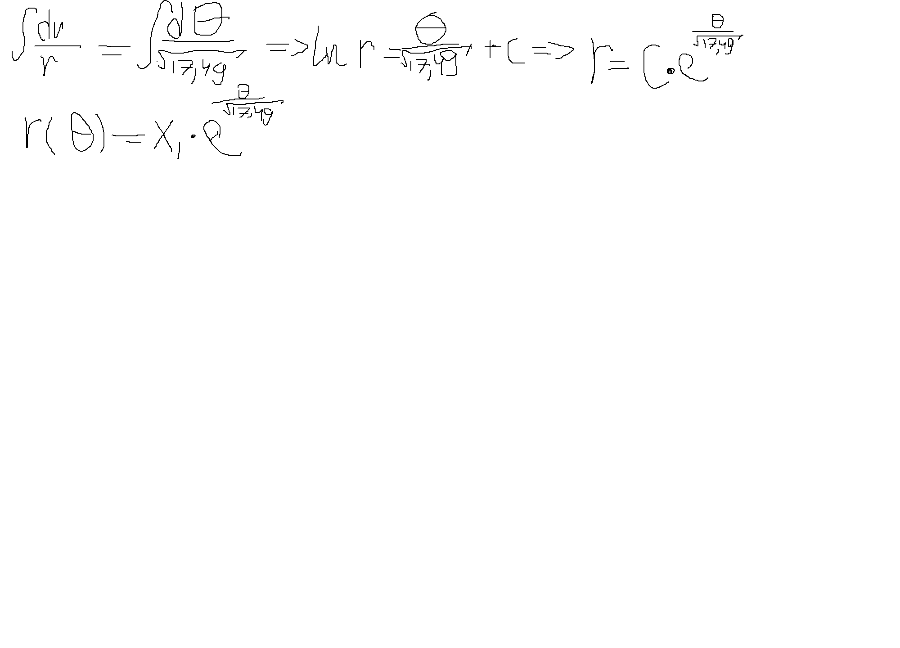{#fig:001 width=70%}

5. Переход в директорию лабораторной работы (~/work/study/2022-2023/Математическое_Моделирование/mathmod/labs/lab2) и создание в ней нового файла в формате Julia -- lab21.jl (2 - номер лабораторной работы; 1 - номер случая, рассматриваемого в данной программе) (Рис. 5).
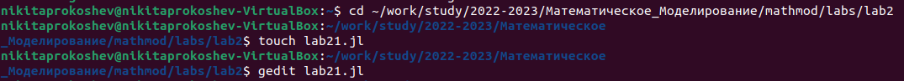{#fig:001 width=70%}

6. Создание программы для решения 1 случая задачи о погоне (Рис. 6), выполнение программы (Рис. 7) и получение результата программы в файле lab21.png (Рис. 8).
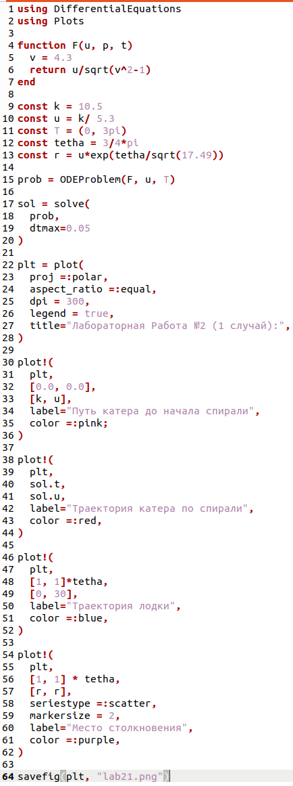{#fig:001 width=70%}
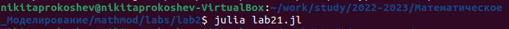{#fig:001 width=70%}
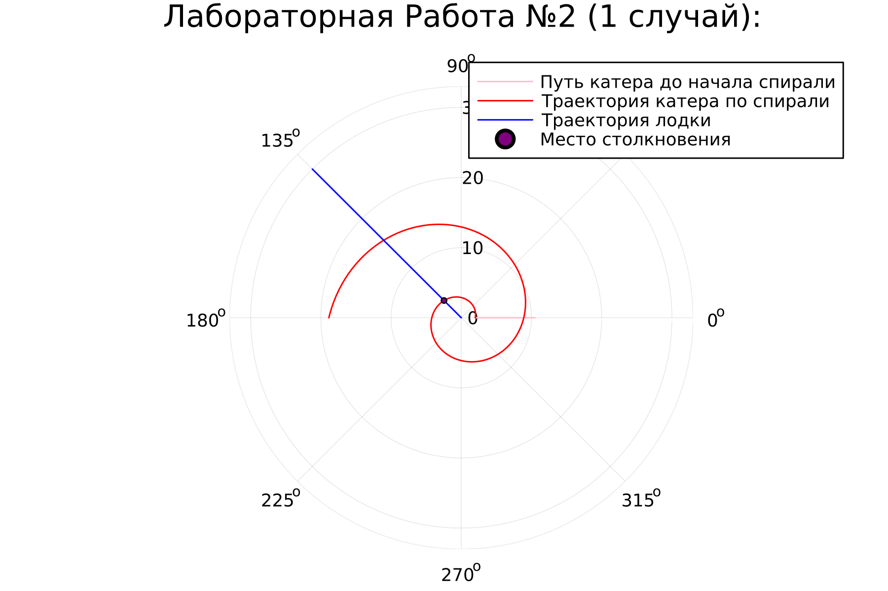{#fig:001 width=70%}

7. Создание нового файла в формате Julia -- lab22.jl (2 - номер лабораторной работы; 2 - номер случая, рассматриваемого в данной программе) (Рис. 9), программы для решения 2 случая задачи о погоне (Рис. 10), выполнение программы (Рис. 11) и получение результата программы в файле lab22.png (Рис. 12).
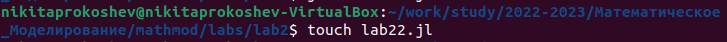{#fig:001 width=70%}
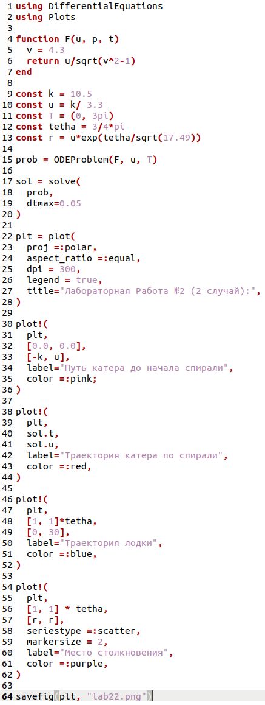{#fig:001 width=70%}
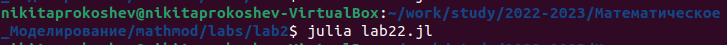{#fig:001 width=70%}
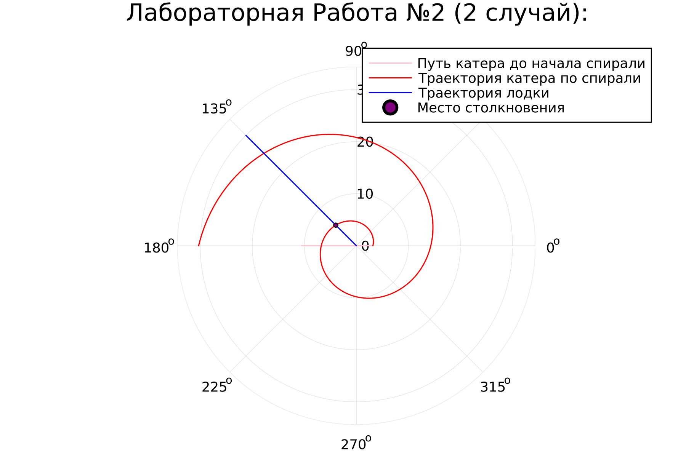{#fig:001 width=70%}

К сожалению, функционал языка программирования OpenModelica не позволяет реализовать данную задачу, поэтому на OpenModelica данная программа не была решена.

# Выводы

В ходе данной лабораторной работы мы изучили задачу о погоне и языки программирования Julia и OpenModelica а также научились решать данную задачу и писать программы на языках Julia и OpenModelica.

# Список литературы{.unnumbered}

::: {#refs}
:::
