---
## Front matter
lang: ru-RU
title: Презентация Лабораторной работы №3
subtitle: По дисциплине Математическое моделирование
author:
  - Прокошев Н.Е.
institute:
  - Российский университет дружбы народов, Москва, Россия
date: 25 февраля 2023

## i18n babel
babel-lang: russian
babel-otherlangs: english

## Formatting pdf
toc: false
toc-title: Содержание
slide_level: 2
aspectratio: 169
section-titles: true
theme: metropolis
header-includes:
 - '\makeatletter'
 - '\makeatother'
---

# Информация

## Докладчик

:::::::::::::: {.columns align=center}
::: {.column width="70%"}

  * Прокошев Никита Евгеньевич
  * студент НФИбд-02-20
  * Факультет Физико-Математических и Естественных наук
  * Российский университет дружбы народов
  * [1032202460@rudn.ru](mailto:1032202460@rudn.ru)
  * <https://github.com/neprokoshev>

:::
::::::::::::::

# Вводная часть

## Объект и предмет исследования

- Модель боевых действий
- Уравнение Ланчестера
- Язык программирования Julia
- Программное обеспечение OpenModelica

## Цели и задачи

Цель: изучить задачу о модели боевых действий.

Задание:
1. Изучить теоретическую составляющую модели боевых действий.
2. Изучить решение данной задачи.
3. Перевести решение в программу на языке программирования Julia.
4. Перевести решение в программу в программном обеспечении OpenModelica.

## Теоретическое введение

Модель боевых действий -- это математическая формула для расчета относительных сил пары сражающихся сторон — подразделений вооруженных сил. В статье «Влияние численности сражающихся сторон на их потери», опубликованной журналом «Военный сборник» в 1915 году, генерал-майор Корпуса военных топографов М. П. Осипов описал математическую модель глобального вооружённого противостояния, практически применяемую в военном деле при описании убыли сражающихся сторон с течением времени и, входящую в математическую теорию исследования операций, на год опередив английского математика Ф. У. Ланчестера.

Уравнения Ланчестера — это дифференциальные уравнения, описывающие зависимость между силами сражающихся сторон A и D как функцию от времени, причем функция зависит только от A и D.

# Выполнение лабораторной работы

1. Для начала разберёмся в задаче "на бумаге". Для этого создадим изображение, в котором распишем основные компоненты уравнения Ланчестера (Рис. @pic:001). После этого выпишем основные компоненты уравнения Ланчестера (Рис. @pic:002).

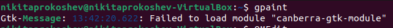{#pic:001 width=70%}
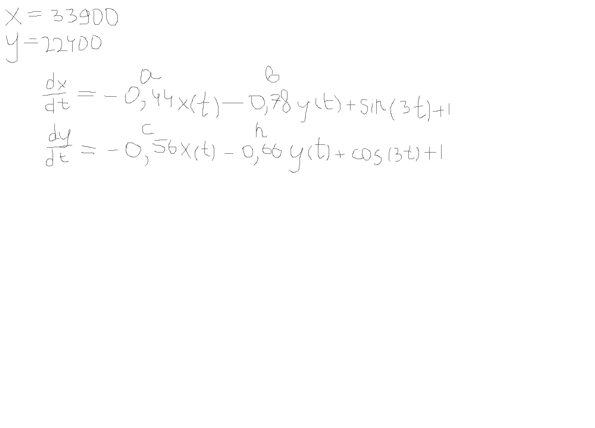{#pic:002 width=70%}

2. Перейдём к программированию данной задачи. Для этого откроем OpenModelicaEdit (Рис. @pic:003).

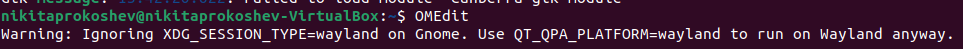{#pic:003 width=70%}

3. Пишем код программы, моделирующей боевые действия (Рис. @pic:004).

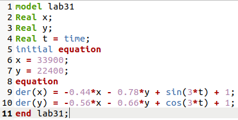{#pic:004 width=70%}

4. Смотрим результат выполнения программы lab31.mo (Рис. @pic:005).

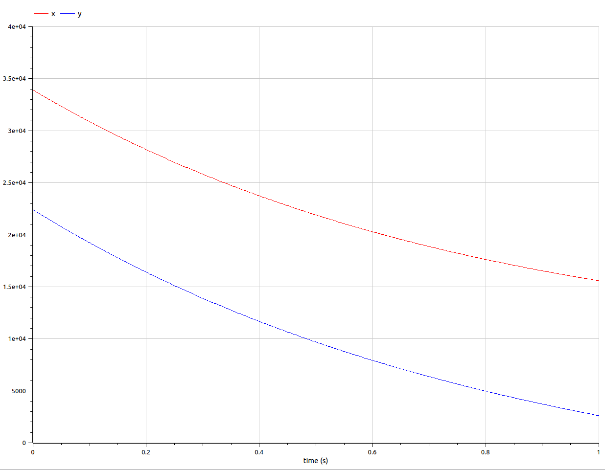{#pic:005 width=70%}

5. Пишем аналогичную программу, только рассматривающую 2 случай модели -- битва с партизанскими отрядами (Рис. @pic:006).

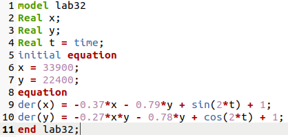{#pic:006 width=70%}

6. Смотрим результат выполнения программы lab32.mo (Рис. @pic:007).

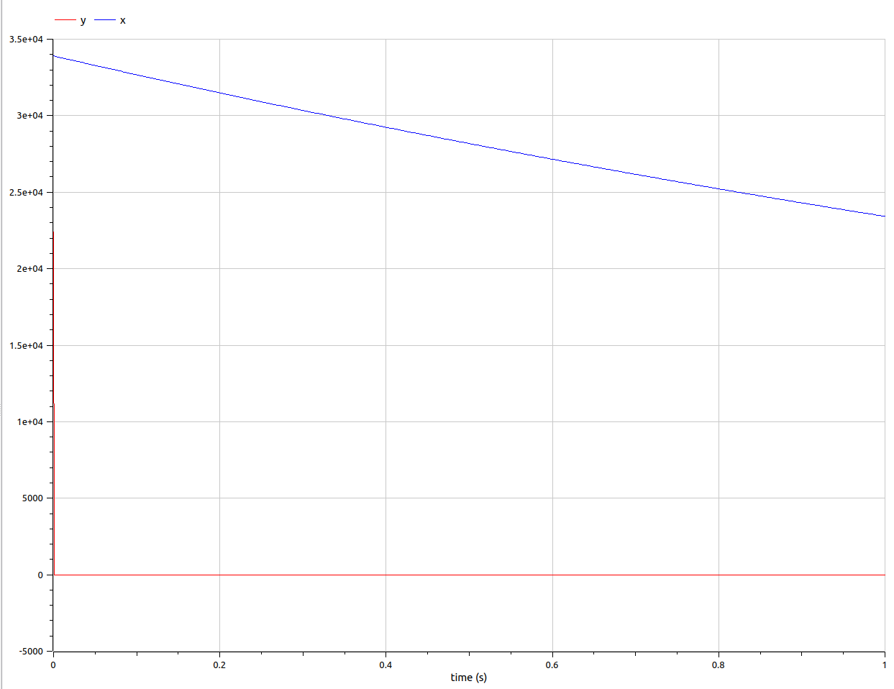{#pic:007 width=70%}

7. Переходим к программированию модели на языке программирования Julia. Для этого переходим в директиву лабораторной работы и создаём файл lab31.jl и переходим к его редактированию (Рис. @pic:008).

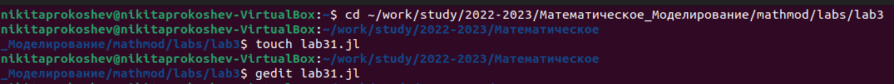{#pic:008 width=70%}

8. Пишем код программы, моделирующей боевые действия (Рис. @pic:009).

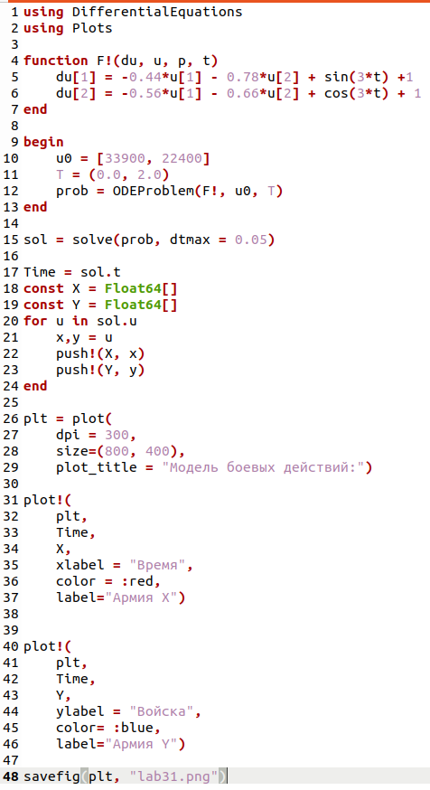{#pic:009 width=70%}

9. Выполняем программу lab31.jl через терминал (Рис. @pic:010) и смотрим результат выполнения программы (Рис. @pic:011).

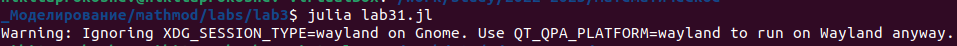{#pic:010 width=70%}
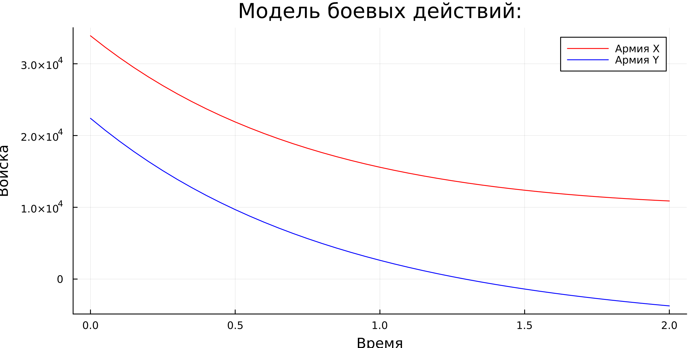{#pic:011 width=70%}

10. Создаём новый файл lab32.jl (Рис. @pic:012).

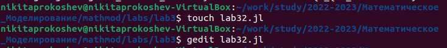{#pic:012 width=70%}

11. Пишем код программы, моделирующей боевые действия с партизанскими отрядами (Рис. @pic:013).

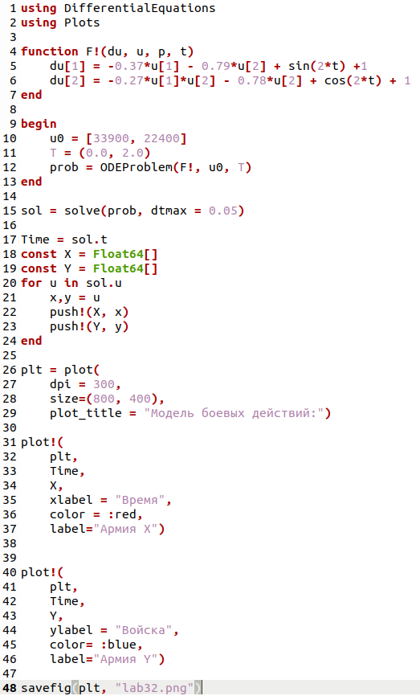{#pic:013 width=70%}

12. Выполняем программу lab32.jl через терминал (Рис. @pic:014) и смотрим результат выполнения программы (Рис. @pic:015).

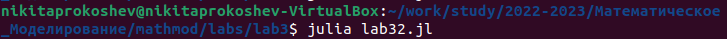{#pic:014 width=70%}
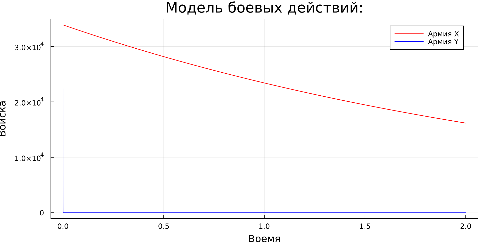{#pic:015 width=70%}

# Выводы

В ходе данной лабораторной работы мы изучили модель боевых действий при помощи уравнения Ланчестера и программирование данной задачи на языке программирования Julia и в программном обеспечении OpenModelica.

:::

