---
## Front matter
title: "Отчёт Лабораторной работы №3"
subtitle: "По дисциплине Математическое моделирование"
author: "Прокошев Никита Евгеньевич"

## Generic otions
lang: ru-RU
toc-title: "Содержание"

## Bibliography
bibliography: bib/cite.bib
csl: pandoc/csl/gost-r-7-0-5-2008-numeric.csl

## Pdf output format
toc: true # Table of contents
toc-depth: 2
lof: true # List of figures
lot: true # List of tables
fontsize: 12pt
linestretch: 1.5
papersize: a4
documentclass: scrreprt
## I18n polyglossia
polyglossia-lang:
  name: russian
  options:
	- spelling=modern
	- babelshorthands=true
polyglossia-otherlangs:
  name: english
## I18n babel
babel-lang: russian
babel-otherlangs: english
## Fonts
mainfont: PT Serif
romanfont: PT Serif
sansfont: PT Sans
monofont: PT Mono
mainfontoptions: Ligatures=TeX
romanfontoptions: Ligatures=TeX
sansfontoptions: Ligatures=TeX,Scale=MatchLowercase
monofontoptions: Scale=MatchLowercase,Scale=0.9
## Biblatex
biblatex: true
biblio-style: "gost-numeric"
biblatexoptions:
  - parentracker=true
  - backend=biber
  - hyperref=auto
  - language=auto
  - autolang=other*
  - citestyle=gost-numeric
## Pandoc-crossref LaTeX customization
figureTitle: "Рис."
tableTitle: "Таблица"
listingTitle: "Листинг"
lofTitle: "Список иллюстраций"
lotTitle: "Список таблиц"
lolTitle: "Листинги"
## Misc options
indent: true
header-includes:
  - \usepackage{indentfirst}
  - \usepackage{float} # keep figures where there are in the text
  - \floatplacement{figure}{H} # keep figures where there are in the text
---

# Цель работы

Цель: изучить задачу о модели боевых действий.

# Задание

1. Изучить теоретическую составляющую модели боевых действий.
2. Изучить решение данной задачи.
3. Перевести решение в программу на языке программирования Julia.
4. Перевести решение в программу в программном обеспечении OpenModelica.

# Теоретическое введение

Модель боевых действий -- это математическая формула для расчета относительных сил пары сражающихся сторон — подразделений вооруженных сил. В статье «Влияние численности сражающихся сторон на их потери», опубликованной журналом «Военный сборник» в 1915 году, генерал-майор Корпуса военных топографов М. П. Осипов описал математическую модель глобального вооружённого противостояния, практически применяемую в военном деле при описании убыли сражающихся сторон с течением времени и, входящую в математическую теорию исследования операций, на год опередив английского математика Ф. У. Ланчестера.

Уравнения Ланчестера — это дифференциальные уравнения, описывающие зависимость между силами сражающихся сторон A и D как функцию от времени, причем функция зависит только от A и D. [@link1] 

# Выполнение лабораторной работы

1. Для начала разберёмся в задаче "на бумаге". Для этого создадим изображение, в котором распишем основные компоненты уравнения Ланчестера (Рис. @pic:001). После этого выпишем основные компоненты уравнения Ланчестера (Рис. @pic:002).

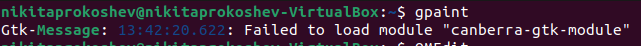{#pic:001 width=70%}
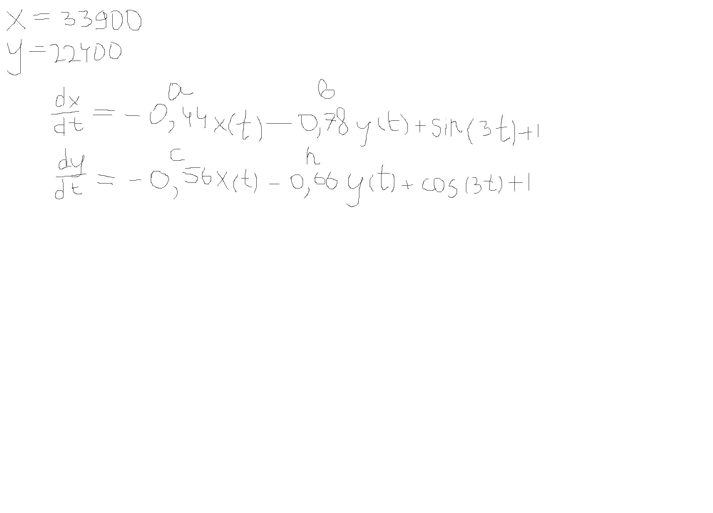{#pic:002 width=70%}

2. Перейдём к программированию данной задачи. Для этого откроем OpenModelicaEdit (Рис. @pic:003).

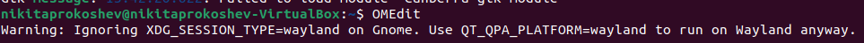{#pic:003 width=70%}

3. Пишем код программы, моделирующей боевые действия (Рис. @pic:004).

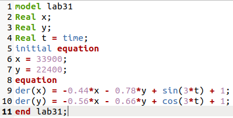{#pic:004 width=70%}

4. Смотрим результат выполнения программы lab31.mo (Рис. @pic:005).

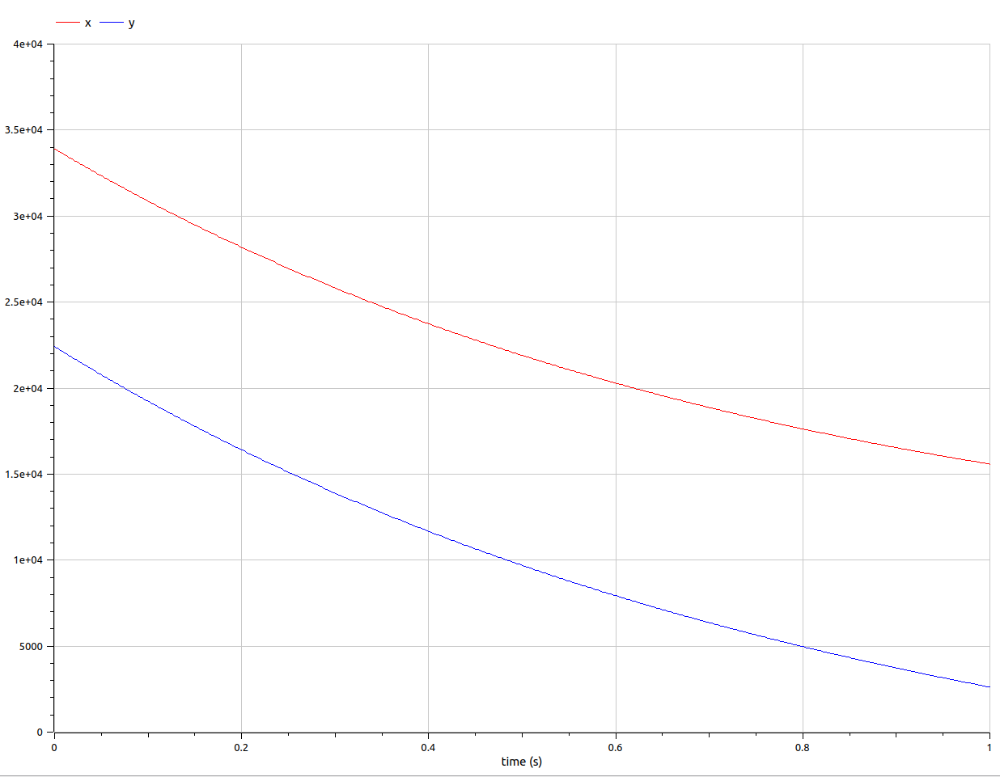{#pic:005 width=70%}

5. Пишем аналогичную программу, только рассматривающую 2 случай модели -- битва с партизанскими отрядами (Рис. @pic:006).

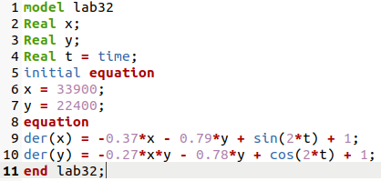{#pic:006 width=70%}

6. Смотрим результат выполнения программы lab32.mo (Рис. @pic:007).

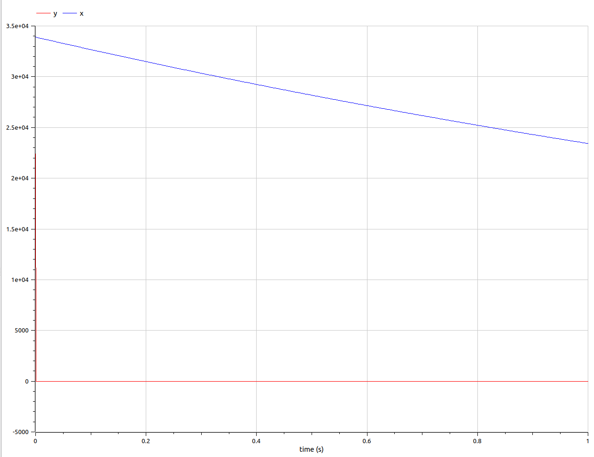{#pic:007 width=70%}

7. Переходим к программированию модели на языке программирования Julia. Для этого переходим в директиву лабораторной работы и создаём файл lab31.jl и переходим к его редактированию (Рис. @pic:008).

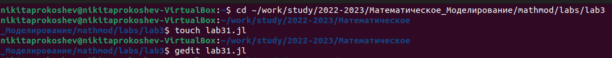{#pic:008 width=70%}

8. Пишем код программы, моделирующей боевые действия (Рис. @pic:009).

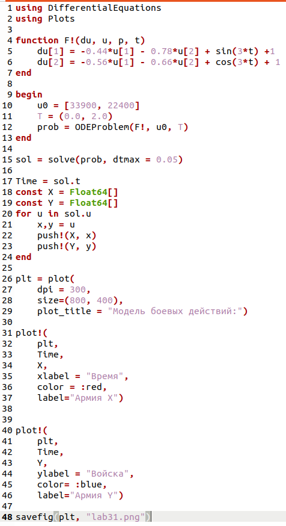{#pic:009 width=70%}

9. Выполняем программу lab31.jl через терминал (Рис. @pic:010) и смотрим результат выполнения программы (Рис. @pic:011).

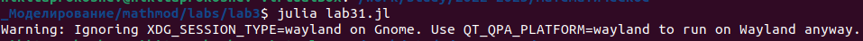{#pic:010 width=70%}
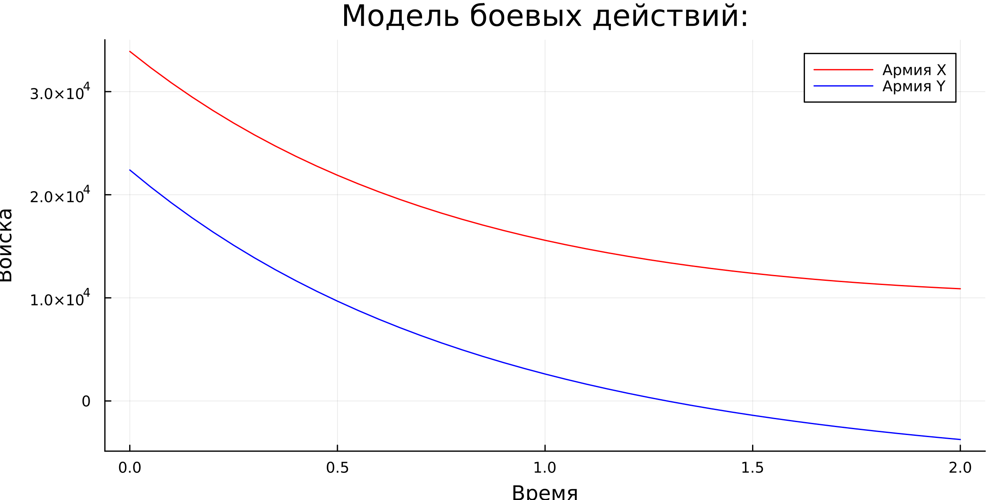{#pic:011 width=70%}

10. Создаём новый файл lab32.jl (Рис. @pic:012).

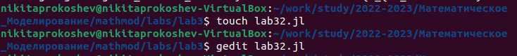{#pic:012 width=70%}

11. Пишем код программы, моделирующей боевые действия с партизанскими отрядами (Рис. @pic:013).

{#pic:013 width=70%}

12. Выполняем программу lab32.jl через терминал (Рис. @pic:014) и смотрим результат выполнения программы (Рис. @pic:015).

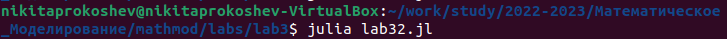{#pic:014 width=70%}
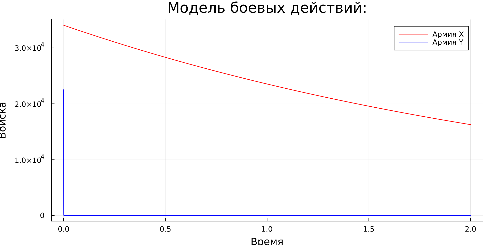{#pic:015 width=70%}

# Выводы

В ходе данной лабораторной работы мы изучили модель боевых действий при помощи уравнения Ланчестера и программирование данной задачи на языке программирования Julia и в программном обеспечении OpenModelica.

# Список литературы{.unnumbered}

::: {#refs}
:::
