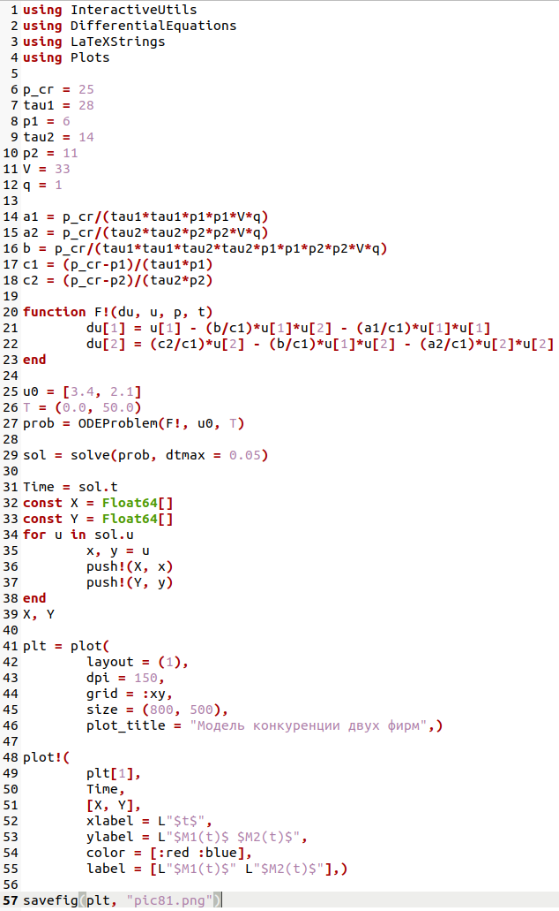
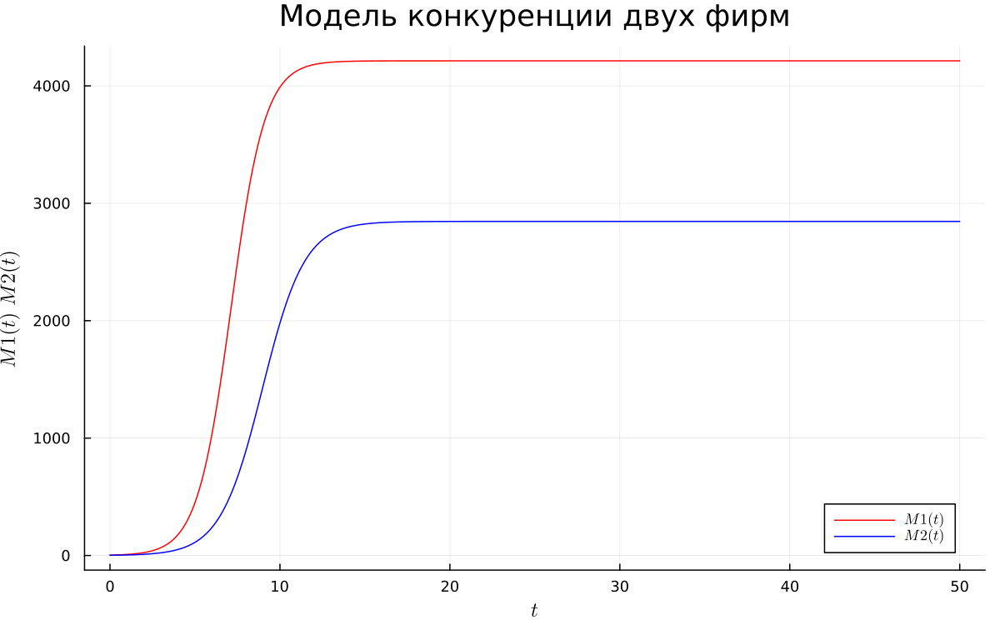
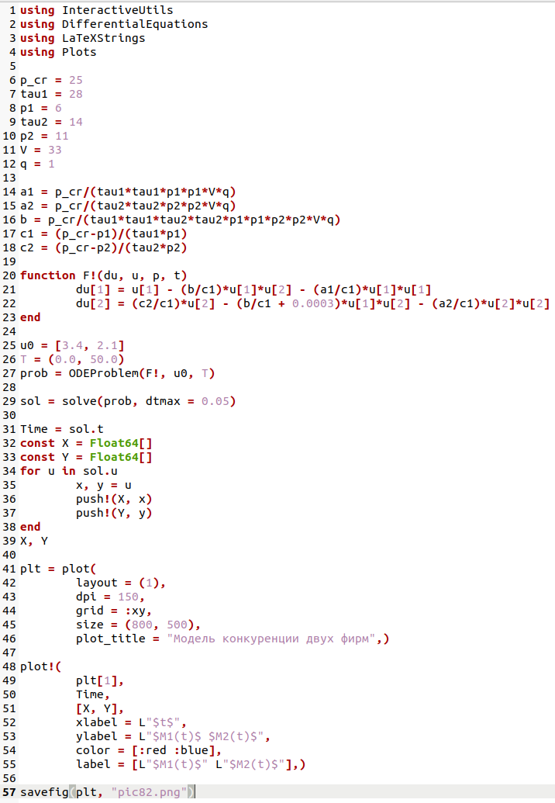
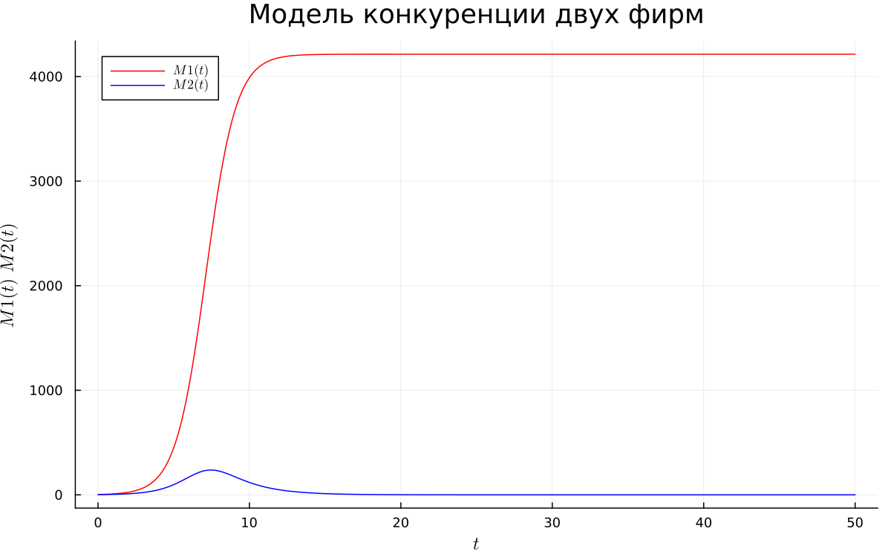
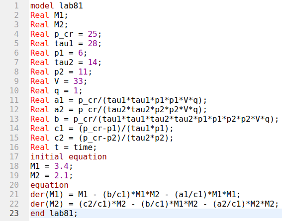
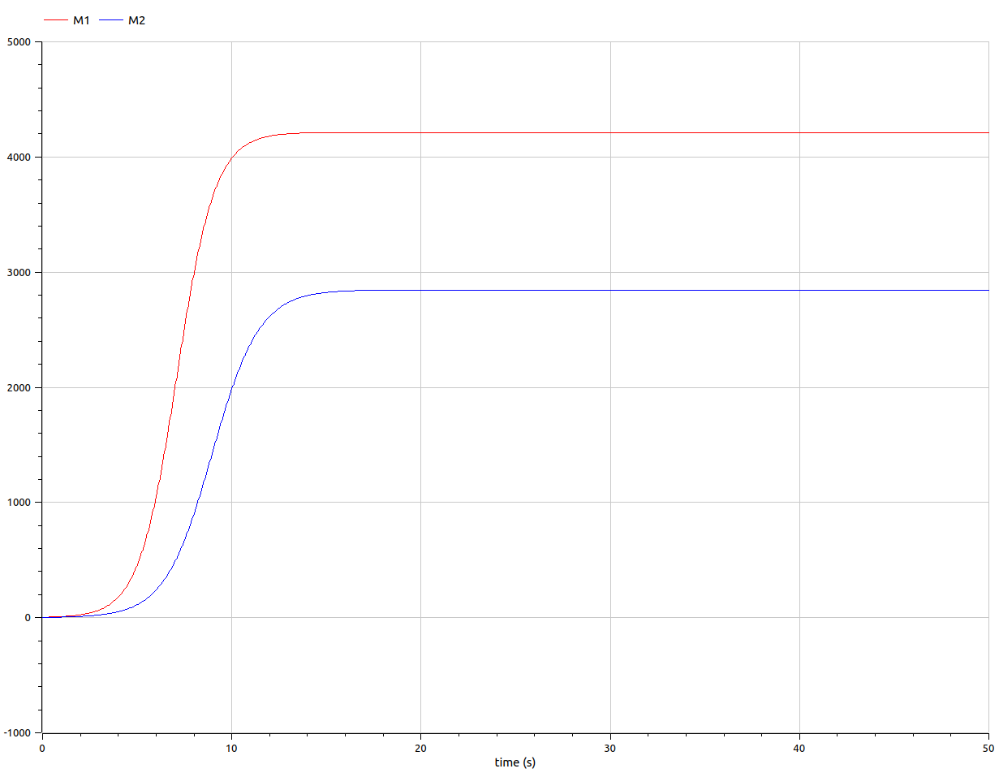
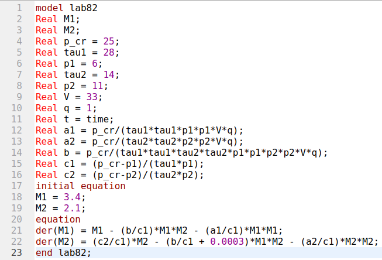
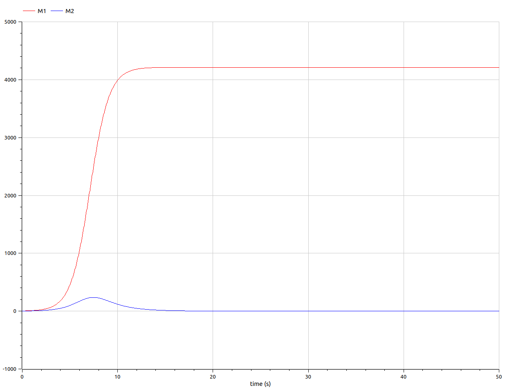

---
## Front matter
lang: ru-RU
title: Презентация Лабораторной работы №8
subtitle: По дисциплине Математическое моделирование
author:
  - Прокошев Н.Е.
institute:
  - Российский университет дружбы народов, Москва, Россия
date: 1 апреля 2023

## i18n babel
babel-lang: russian
babel-otherlangs: english

## Formatting pdf
toc: false
toc-title: Содержание
slide_level: 2
aspectratio: 169
section-titles: true
theme: metropolis
header-includes:
 - '\makeatletter'
 - '\makeatother'
---

# Информация

## Докладчик

:::::::::::::: {.columns align=center}
::: {.column width="70%"}

  * Прокошев Никита Евгеньевич
  * студент НФИбд-02-20
  * Факультет Физико-Математических и Естественных наук
  * Российский университет дружбы народов
  * [1032202460@rudn.ru](mailto:1032202460@rudn.ru)
  * <https://github.com/neprokoshev>

:::
::::::::::::::

# Вводная часть

## Объект и предмет исследования

- Модель конкуренции двух фирм
- Язык программирования Julia
- Программное обеспечение OpenModelica

## Цели и задачи

Цель: изучить задачу о модели конкуренции двух фирм.

Задание:
1. Изучить теоретическую составляющую модели конкуренции двух фирм.
2. Изучить решение данной задачи.
3. Перевести решение в программу на языке программирования Julia.
4. Перевести решение в программу в программном обеспечении OpenModelica.

# Выполнение лабораторной работы

1. Переходим к программированию модели на языке программирования Julia. Для этого переходим в директиву лабораторной работы, создаём файл lab81.jl и пишем код программы (Рис. @pic:001).

{#pic:001 width=70%}

2. Получаем модель конкуренции двух фирм (1 случай) (Рис. @pic:002).

{#pic:002 width=70%}

3. Создаём второй файл — lab82.jl и пишем код программы (Рис. @pic:003).

{#pic:003 width=70%}

4. Получаем модель конкуренции двух фирм (2 случай) (Рис. @pic:004).

{#pic:004 width=70%}

5. Переходим к моделированию эффективности рекламы в OpenModelica. Для этого создаём файл lab81.mo и пишем код программы (Рис. @pic:005).

{#pic:005 width=70%}

6. Получаем модель конкуренции двух фирм (1 случай) (Рис. @pic:006).

{#pic:006 width=70%}

7. Cоздаём файл lab82.mo и пишем код программы (Рис. @pic:007).

{#pic:007 width=70%}

8. Получаем модель конкуренции двух фирм (2 случай) (Рис. @pic:008).

{#pic:008 width=70%}

# Выводы

В ходе данной лабораторной работы мы изучили модель конкуренции двух фирм и программирование данной задачи на языке программирования Julia и в программном обеспечении OpenModelica.

:::

