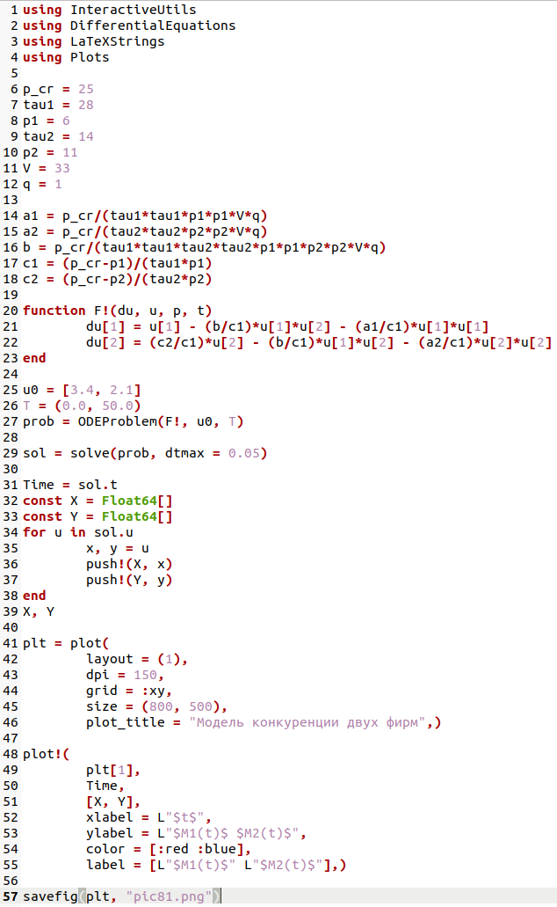
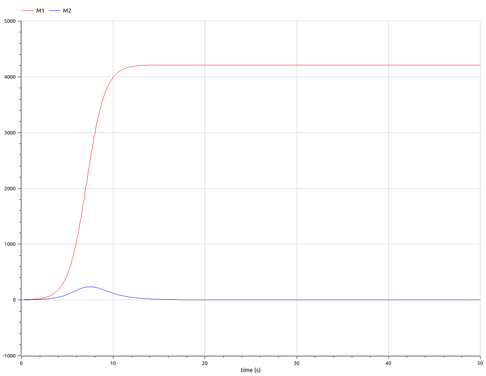

---
## Front matter
title: "Отчёт Лабораторной работы №8"
subtitle: "По дисциплине Математическое моделирование"
author: "Прокошев Никита Евгеньевич"

## Generic otions
lang: ru-RU
toc-title: "Содержание"

## Bibliography
bibliography: bib/cite.bib
csl: pandoc/csl/gost-r-7-0-5-2008-numeric.csl

## Pdf output format
toc: true # Table of contents
toc-depth: 2
lof: true # List of figures
lot: true # List of tables
fontsize: 12pt
linestretch: 1.5
papersize: a4
documentclass: scrreprt
## I18n polyglossia
polyglossia-lang:
  name: russian
  options:
	- spelling=modern
	- babelshorthands=true
polyglossia-otherlangs:
  name: english
## I18n babel
babel-lang: russian
babel-otherlangs: english
## Fonts
mainfont: PT Serif
romanfont: PT Serif
sansfont: PT Sans
monofont: PT Mono
mainfontoptions: Ligatures=TeX
romanfontoptions: Ligatures=TeX
sansfontoptions: Ligatures=TeX,Scale=MatchLowercase
monofontoptions: Scale=MatchLowercase,Scale=0.9
## Biblatex
biblatex: true
biblio-style: "gost-numeric"
biblatexoptions:
  - parentracker=true
  - backend=biber
  - hyperref=auto
  - language=auto
  - autolang=other*
  - citestyle=gost-numeric
## Pandoc-crossref LaTeX customization
figureTitle: "Рис."
tableTitle: "Таблица"
listingTitle: "Листинг"
lofTitle: "Список иллюстраций"
lotTitle: "Список таблиц"
lolTitle: "Листинги"
## Misc options
indent: true
header-includes:
  - \usepackage{indentfirst}
  - \usepackage{float} # keep figures where there are in the text
  - \floatplacement{figure}{H} # keep figures where there are in the text
---

# Цель работы

Цель: изучить задачу о модели конкуренции двух фирм.

# Задание

1. Изучить теоретическую составляющую модели конкуренции двух фирм.
2. Изучить решение данной задачи.
3. Перевести решение в программу на языке программирования Julia.
4. Перевести решение в программу в программном обеспечении OpenModelica.

# Выполнение лабораторной работы

1. Переходим к программированию модели на языке программирования Julia. Для этого переходим в директиву лабораторной работы, создаём файл lab81.jl и пишем код программы (Рис. @pic:001).

{#pic:001 width=70%}

2. Получаем модель конкуренции двух фирм (1 случай) (Рис. @pic:002).

{#pic:002 width=70%}

3. Создаём второй файл — lab82.jl и пишем код программы (Рис. @pic:003).

{#pic:003 width=70%}

4. Получаем модель конкуренции двух фирм (2 случай) (Рис. @pic:004).

{#pic:004 width=70%}

5. Переходим к моделированию эффективности рекламы в OpenModelica. Для этого создаём файл lab81.mo и пишем код программы (Рис. @pic:005).

{#pic:005 width=70%}

6. Получаем модель конкуренции двух фирм (1 случай) (Рис. @pic:006).

{#pic:006 width=70%}

7. Cоздаём файл lab82.mo и пишем код программы (Рис. @pic:007).

{#pic:007 width=70%}

8. Получаем модель конкуренции двух фирм (2 случай) (Рис. @pic:008).

{#pic:008 width=70%}

# Выводы

В ходе данной лабораторной работы мы изучили модель конкуренции двух фирм и программирование данной задачи на языке программирования Julia и в программном обеспечении OpenModelica.

# Список литературы{.unnumbered}

::: {#refs}
:::
